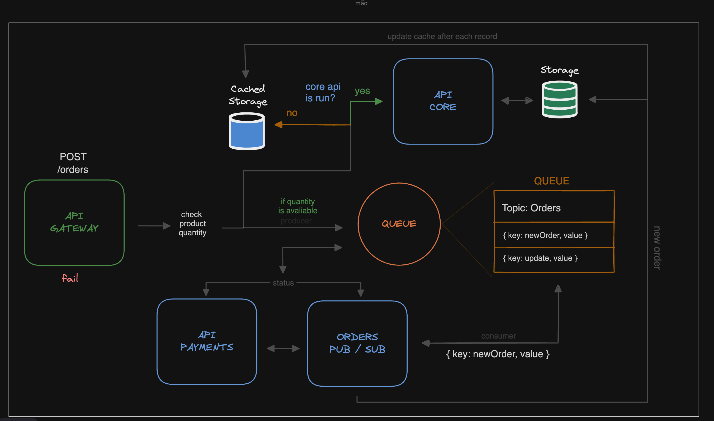

# Menu Online API

---

## Descrição do Projeto

O projeto consiste em uma API que permite o cadastro de pessoas fisicas que por sua vez podem cadastrar restaurantes e lanchonetes que possuem um CNPJ e podem cadastrar produtos que podem ser pedidos por clientes. Os clientes podem fazer pedidos e acompanhar o status do pedido.

O projeto foi desenvolvido como um projeto de prática de estudos sobre Clean Architecture, SOLID, Design Patterns.

A ideia inicial era conter uma única aplicação (Core) para lidar com todo o sistema. Durante o desenvolvimento, percebemos o problema que poderia causar caso a aplicação Core ficasse indisponível. Os pedidos não poderiam ser gerados, para resolver esse problema, decimos dividir em microserviços e foi implementado um sistema de mensageria (Kafka) para que a aplicação Core não precise lidar com os pedidos diretamente, apenas com o cadastro de restaurantes e produtos.

API Gateway foi implementada para que o cliente não precise saber qual API deve chamar para cadastrar um pedido, ele apenas chama a API Gateway e ela se encarrega de enviar para a API de Orders ou para a API Core.

Quando um novo usuário deseja se cadastrar no sistema, a API Gateway envia a requisição para a API Core, que por sua vez salva no banco de dados. O mesmo acontece quando um novo restaurante ou produto é cadastrado.

No caso de um novo pedido a API Gateway faz uma consulta na API Core, validando a quantidade de itens disponível. Caso a API Core está indisponível, a consulta será feita no banco de cache (Redis). Em seguida o pedido é enviado para a fila que será consumido pela API Orders que salva o pedido no banco de dados principal (Postgres), atualiza o banco de cache (Redis) com o status de pendente.

Na sequência a forma de pagamento é enviada para a API Payments que valida se o pagamento foi aprovado ou não e envia uma mensagem para a fila que será consumida pela API Orders que atualiza o banco de dados principal (Postgres) com o status de aprovado ou reprovado.

---

## Tecnologias utilizadas

### API Core

- [Node.js](https://nodejs.org/en/)
- [Express](https://expressjs.com/pt-br/)
- [TypeScript](https://www.typescriptlang.org/)
- [Prisma](https://www.prisma.io/)
- [Jest](https://jestjs.io/)

### API Gateway

- [Python](https://www.python.org/)
- [FastAPI](https://fastapi.tiangolo.com/)

### API de Orders (Pub/Sub)

- [Python](https://www.python.org/)

### Sistema de Mensageria

- [Kafka](https://kafka.apache.org/)
- [Zookeeper](https://zookeeper.apache.org/)

### Banco de Dados

- [PostgreSQL](https://www.postgresql.org/)
- [Redis](https://redis.io/)

### Outros

- [Docker](https://www.docker.com/)
- [Docker Compose](https://docs.docker.com/compose/)
- [Control Center](https://docs.confluent.io/platform/current/control-center/index.html)
- [Github Actions](https://docs.github.com/pt/actions)

---

### Design da aplicação

---

### Como rodar a aplicação

- Clone o repositório
- Execute o comando `docker-compose up -d` na raiz do projeto
- Acesse o Control Center em http://localhost:9021/
- Acesse a API Gateway em http://localhost:3333
  - Acesse a documentação da API Gateway [aqui](http://localhost:3333/docs)
- Acesse a API Core em http://localhost:3001
  - Acesse a documentação da API Core [aqui](https://github.com/Thiago-Mariotto/menu-online-api/tree/main/main/docs)
- Acesse a API Payments [em breve]

---

## Contribuidores

<table align="center">
  <tr>
  <td align="center">
      <a href="github.com/rafaeltedesco">
         
        
          <b>Rafael Tedesco</b>
        
      </a>
    </td>
    <td align="center">
      <a href="github.com/thiago-mariotto">
         
        
          <b>Thiago Mariotto</b>
        
      </a>
    </td>
  <tr>
</table>
